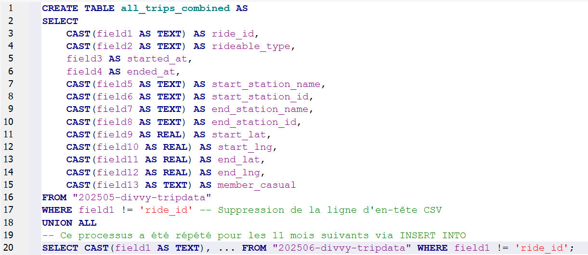
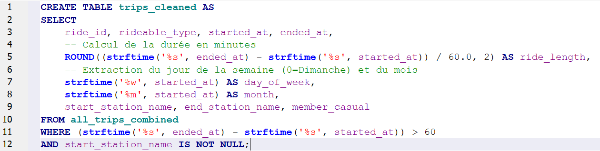
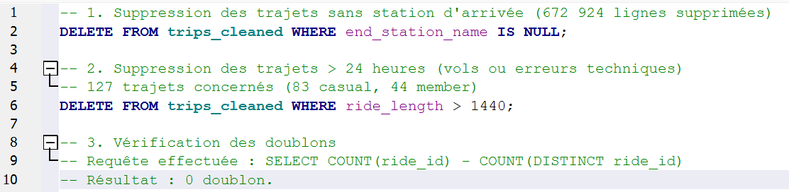
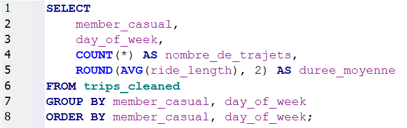
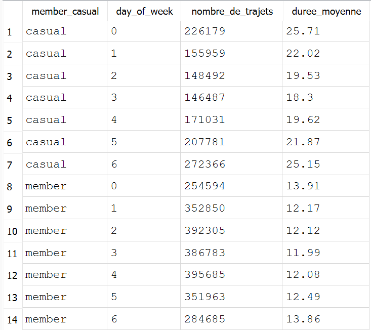
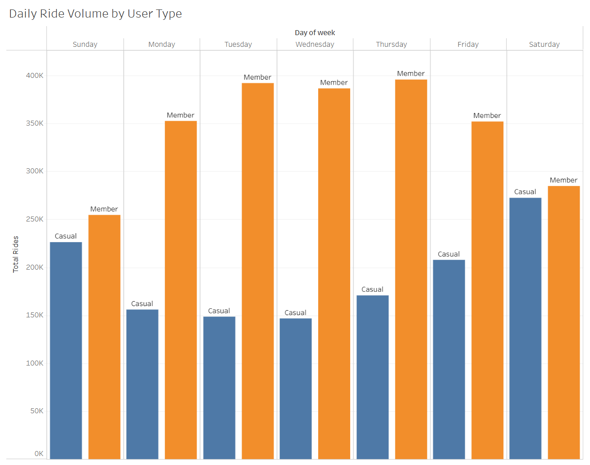
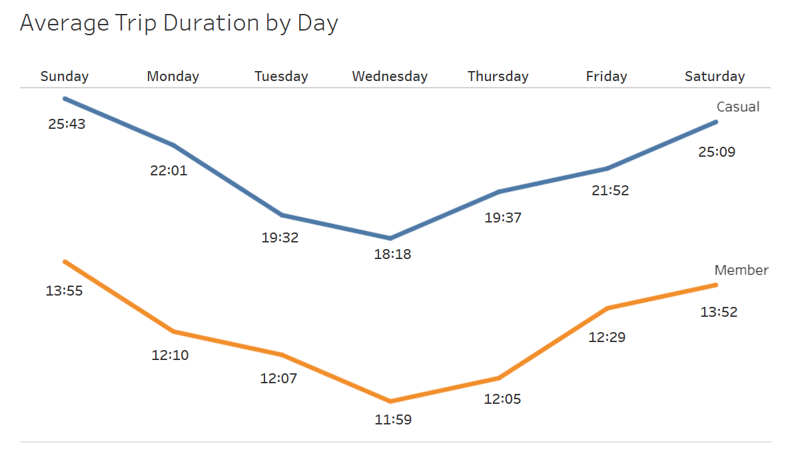

Case Study: How Does a Bike-Share Navigate Speedy Success? (Cyclistic)

Introduction

In this case study, I am acting as a junior data analyst working on the marketing analyst team at Cyclistic, a bike-share company in Chicago.

Cyclistic operates a fleet of more than 5,800 bicycles tracked and locked into a network of 600 docking stations. The company has two types of clients: casual riders and annual members, with the latter identified by financial analysts as much more profitable. The director of marketing, Lily Moreno, aims to maximize the number of annual members by converting existing casual riders rather than targeting entirely new customers. To achieve this goal, this analysis follows the six steps of the Google data analysis process: Ask, Prepare, Process, Analyze, Share, and Act.

Phase 1: Ask

The company aims to maximize the number of annual memberships because they are significantly more profitable than casual riders. The business task is to analyze historical bike trip data to understand how annual members and casual riders use Cyclistic bikes differently.

By identifying these distinct trends, the marketing team will design targeted strategies to convert casual riders into annual members. The final findings and professional data visualizations will be presented to Lily Moreno and the executive team to secure approval for the recommended marketing program.

Business Objective: Design marketing strategies aimed at converting casual riders into annual members.

Core Question: How do annual members and casual riders use Cyclistic bikes differently?

Phase 2: Prepare

Data Source Identification
The analysis utilizes Cyclistic’s historical trip data covering a 12-month period (May 2025 – April 2026). The data consists of 12 compressed CSV files publicly available and downloaded from the [official corporate server](https://divvy-tripdata.s3.amazonaws.com/index.html).
The data has been made available by Motivate International Inc. under a specific public license.

Data Credibility Evaluation (ROCCC Quality Framework)
Reliable: ✅ Official data directly captured by the actual operator of the Chicago bike-share system.
Original: ✅ First-party data collected directly by Motivate International Inc. without any third-party modification.
Comprehensive: ✅ Contains a full 12-month period, structured across 13 uniform metadata columns, ranging between 49k and 531k rows per monthly file.
Current: ✅ Up-to-date historical data reflecting recent user habits from May 2025 to April 2026.
Cited: ✅ Clearly identified source with explicit public licensing and data-use privacy agreements.

Data Structure
12 files in .csv format, named using the standard corporate nomenclature: Cyclistic_TripData_YYYYMM.
13 columns (Unique trip ID, user type, start/end timestamps, station IDs, station names, and geographical coordinates).
A mix of quantitative data (trip counts, durations) and qualitative data (user categories, station names).

Security and Data Privacy
Riders’ personally identifiable information (PII) is strictly prohibited due to data-privacy issues.
Original source files are backed up separately in a read-only environment to ensure data preservation.

Identified Data Limitations
Because of data anonymization, it is impossible to connect pass purchases back to credit card numbers. Therefore, we cannot determine if casual riders live within the service area or if they purchase multiple single-ride passes.

Phase 3: Process

To prepare the data for thorough analysis, I executed a rigorous data-cleaning process structured within SQL to guarantee accuracy, consistency, and data integrity.

Technical Environment Selection
The cumulative volume of data to process across the 12-month period exceeds 5 million rows. Traditional spreadsheet software like Excel or Google Sheets cannot handle datasets of this magnitude effectively due to row limitations. Consequently, I chose to perform all data wrangling and processing using SQL via DB Browser for SQLite.

Initial Integrity Control
Before importing the raw data, a comprehensive chronological sweep was performed:
Anomaly Correction: A naming inconsistency was identified in the January 2026 folder, which contained a file accidentally labeled "January 2025". After inspecting the internal file metadata, the data was confirmed to belong to 2026. The folder was renamed properly to prevent chronological skewing.

Data Consolidation and Harmonization (Merging)
The 12 monthly CSV files were merged into a single comprehensive master table named all_trips_combined.
Data Harmonization via CAST: Because certain imported files exhibited automatic formatting discrepancies (such as generic field names like field1, field2, etc.), I applied the CAST function to enforce strict data types (e.g., forcing IDs to TEXT and geographical coordinates to REAL).
Merging Query: The consolidation was executed seamlessly using the UNION ALL operator.

Note: Data cleaning and processing were performed using French software interfaces.
Merge Validation: A distinct count query on the month column post-merge confirmed the exact presence of all 12 active months, proving zero data loss occurred during consolidation.

Data Transformation and Enrichment (trips_cleaned Creation)
To directly answer the business tasks, I calculated and extracted new time-based attributes while creating the final working table trips_cleaned:
ride_length: Computed the exact trip duration in minutes by converting timestamps using strftime('%s').
day_of_week: Extracted the specific day of the week (formatted as 0-6, where 0 represents Sunday).
month: Extracted the numerical month attribute to facilitate seasonal analysis.

Note: Data cleaning and processing were performed using French software interfaces.

Final Cleaning of Outliers and Bias Removal
To ensure the reliability of statistical averages, strict conditional filtering was implemented to eliminate technical anomalies and unrealistic trip lengths:
Removal of Technical Trips and Misstarts: Automatically excluded all trips shorter than or equal to 1 minute (identified as system tests or accidental dock unlocks), as well as station names containing "test" or "maintenance".
Handling Missing Data: Dropped 672,924 rows where the end_station_name field was null (IS NULL). Control Check: A comparative analysis before and after dropping these rows confirmed that the structural ratio between casual riders and annual members remained perfectly stable, proving this step did not introduce any user bias.
Max Duration Filtering: Removed trips exceeding 24 hours (1,440 minutes), which represent unreturned bikes, system locking errors, or potential thefts (amounting to 127 trips: 83 casual riders and 44 members).

Note: Data cleaning and processing were performed using French software interfaces.

Data Quality Check (Validation Step)
Prior to exporting the clean dataset into Tableau for visualization, I ran definitive auditing queries to certify the absolute accuracy of the trips_cleaned table:
Logical Time Validation: The query SELECT COUNT(*) WHERE ride_length < 0 returned a value of 0, confirming no inverted timestamps existed.
Categorical Integrity: The query SELECT DISTINCT member_casual confirmed that exactly two clean strings existed ("member" and "casual"), checking off any accidental typos or trailing whitespaces.
Uniqueness Audit: Confirmed zero duplicated ride_id values (result equal to 0).
Final Data Volume: The cleaned master database contains exactly 3,747,160 clean trips. This massive volume provides an incredibly robust statistical sample size for the analysis phase.

Process Reproducibility
Every step of data manipulation (UNION, CAST, CREATE, DELETE) was fully documented and archived as SQL script files. This practice ensures perfect reproducibility for external audits or future data updates.

Phase Deliverable: The final trips_cleaned table is centralized, standardized, and ready for key metric aggregation (Ref: File 4.png), generating the required summary output table (Ref: File 5.png) for our visualizations.

Phase 4: Analyze

The goal of this phase is to identify the overarching trends and relationships that differentiate how casual riders and annual members navigate the bike-share system.
Data Organization and Formatting
The cleaned data was aggregated by user type (member_casual) and day of the week (day_of_week) to map behavioral patterns directly.
Technical Note: For statistical processing, trip durations were calculated as decimal minutes (e.g., 25.71 minutes) to secure highly accurate averages before formatting.
Note: Data cleaning and processing were performed using French software interfaces.
Core Trends and Analytical Discoveries
A. Trip Volume: Routine vs. Leisure

Note: Data cleaning and processing were performed using French software interfaces.
Analyzing total trip counts reveals completely opposing weekly habits:
Members: Maintain a massive, highly stable trip volume from Monday through Friday, peaking on Tuesdays and Wednesdays (~390K trips). This indicates a highly utilitarian pattern tied to daily work commutes.
Casuals: Experience an exponential surge over the weekend. Saturday stands out as their most active day (272,366 trips), reflecting an 86% increase compared to their baseline weekday volumes.
B. Trip Duration: The Major Structural Gap

Note: Data cleaning and processing were performed using French software interfaces.
This is the most critical revelation within the historical data:
Casual riders consistently stay out on bikes significantly longer than members. On Sundays, a casual rider cruises for an average of 25.71 minutes, which is nearly double the time spent by an annual member (13.91 minutes).
This duration gap persists throughout the entire workweek as well, demonstrating that casual riders view the service as a tool for exploration, tourism, or recreation rather than point-to-point transit efficiency.
Analysis Summary Table
Metric
Casual Riders
Annual Members
Peak Usage Period
Weekends (Saturday / Sunday)
Weekdays (Tuesday to Thursday)
Max Average Duration
~25 minutes
~14 minutes
Primary Use-Case Profile
Leisure, tourism, and recreation
Daily commuting and utility

Strategic Value for Lily Moreno
Financial Leverage: Because casual riders rely on long-duration trips, using the financial savings of an annual membership compared to cumulative pay-per-minute or daily pass pricing acts as a compelling conversion trigger.
Marketing Framing: Conversion campaigns should heavily peak on weekends and summer months when casual volume spikes. The copy should emphasize freedom, unlimited recreational riding, and peace of mind—eliminating the anxiety of "watching the clock tick" during long weekend outings.

Phase 5: Share

I engineered a polished, interactive dashboard on Tableau Public to communicate these insights effectively to the executive team. To ensure high accessibility and data storytelling clarity, a strict visual color code was implemented: Blue for Casual Riders and Orange for Annual Members.
Formatting Note: In the final executive charts below, decimal minutes are converted to standard time notation (Minutes:Seconds) to deliver immediate readability for corporate stakeholders.
1. Daily Ride Volume

Annual members display uniform utilization across weekdays, with a subtle mid-week hump, reinforcing their identity as primary commuter users. Conversely, casual riders exhibit very low relative weekday volume but experience a massive surge on weekends, climbing up to nearly match member volumes on Saturdays.
2. Average Trip Duration by Day

Casual riders log substantially longer trips than members across the board. On Sundays, this contrast peaks: casual riders spend an average of 25:43 on vélos, compared to just 13:55 for members. This multi-minute gap remains highly pronounced even on standard weekdays (e.g., 18:18 for casuals vs. 11:59 for members on Wednesdays), definitively marking an exploratory behavior pattern.
Phase Summary
The visual storytelling mathematically validates that casual riders are high-value consumers who regularly pay premium rates for extended trip times. Transitioning them to an annual tier represents an incredible upside for recurring company revenue.

Phase 6: Act

Armed with clear data-backed trends, the Cyclistic executive team can confidently transition from baseline analysis to localized, revenue-driving business strategies.
Data-Driven Strategic Recommendations (Top 3)
Launch a "Weekend Warrior" Annual Membership Tier: Since casual user volume peaks aggressively on Saturdays and Sundays (with maximum average durations of 25:09 and 25:43), creating an exclusive, lower-cost weekend annual pass can smoothly capture recreational users who do not require a standard 5-day commuting subscription.
Execute Duration-Based Savings Campaigns: Because casual riders clock trips that are more than twice as long as members, marketing materials should showcase the annual membership as a financial tool that unlocks “unlimited long-duration rides without ticking clock fees.” Visualizing the cumulative pay-per-minute cost of their current weekend habits against a flat annual membership fee will cleanly emphasize their personal savings.
Deploy "Ready for the Weekend" Digital Campaigns: Run localized, geo-targeted mobile and social media advertisements on Friday afternoons and Saturday mornings. Placing these ads directly around high-traffic bike docking stations will nudge casual riders into upgrading to an annual tier immediately before unlocking a bike for their weekend leisure plans.
Proposed Next Steps
Secondary Location-Based Spatial Analysis: Conduct an advanced spatial analysis mapping coordinate data to pinpoint the exact geographic station hotspots where casual riders unlock bikes on weekends (e.g., parks, coastal paths, tourist attractions). This data will allow the marketing team to optimize physical ad placement and concentrate bike inventory where conversion opportunities are highest.
Technical Toolkit Demonstrated
SQL (SQLite/BigQuery): Consolidated massive multi-million-row databases (>5M records), utilized complex data cleaning commands (CAST, UNION ALL, DELETE WHERE IS NULL, conditional bounds handling), and conducted database health checks.
Tableau Public: Developed clear executive visualizations, structured multi-axis temporal charts, implemented strict color-coded data storytelling, and refined labeling aesthetics.
Google Sheets: Executed initial data validation, structural syntax analysis, and source file integrity checks.
